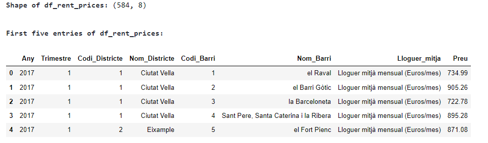
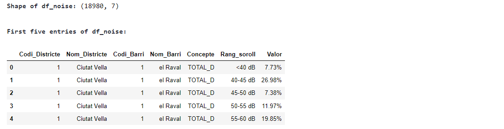
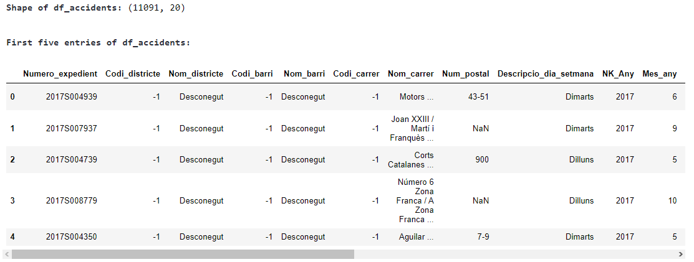

### Project Description

This analysis centers on multiple datasets pertaining to Barcelona. Each dataset provides insights into distinct facets of the city—ranging from housing costs to environmental factors and public safety.

#### Datasets:

1. **Barcelona Rent**:
    - **Description**: Data about the average monthly rent (€/month) and by surface area (€/m2) in the city of Barcelona for the year 2017.
    - **Source**: [Open Data Barcelona](https://opendata-ajuntament.barcelona.cat/data/es/dataset/est-mercat-immobiliari-lloguer-mitja-mensual/resource/0a71a12d-55fa-4a76-b816-4ee55f84d327)
    - **File**: `2017_Alquiler_precio_trim.csv`

    
2. **Noise Exposure**:
    - **Description**: Information about the population's exposure to noise levels from the Strategic Noise Map of Barcelona.
    - **Source**: [Open Data Barcelona](https://opendata-ajuntament.barcelona.cat/data/es/dataset/poblacio-exposada-mapa-estrategic-soroll/resource/3846500e-72aa-4780-967f-f09aa184eaba)
    - **File**: `2017_Poblacio_exposada_barris_Mapa_Estrategic_Soroll_BCN_LONG.csv`

    
3. **Traffic Accidents**:
    - **Description**: Data about traffic accidents managed by the Urban Guard in Barcelona.
    - **Source**: [Open Data Barcelona](https://opendata-ajuntament.barcelona.cat/data/ca/dataset/accidents_causa_conductor_gu_bcn/resource/1a05cdd4-4844-41a5-872d-a0824d11b517?inner_span=True)
    - **File**: `2017_ACCIDENTS_CAUSA_CONDUCTOR_GU_BCN_.csv`

The objective of this analysis is to comprehensively evaluate these datasets to elucidate the socioeconomic and environmental dynamics shaping Barcelona.

    <h4 style="margin-top: 0.3em; margin-bottom: 0.3em;">1. Load the Data</h4>      

    - Let's first load the datasets   

    <h4 style="margin-top: 0.3em; margin-bottom: 0.3em;">2. Exploratory Analysis</h4>      

    - Let's check for missing values and review the datasets structure for each dataset  

    <h4 style="margin-top: 0.3em; margin-bottom: 0.3em;">Rent Prices Dataset (df_rent_prices):</h4>
    This dataset provides insights into the average rental prices in different districts and neighborhoods of a city, presumably Barcelona, for the year 2017.

**Columns and Data Types:**

- **Any** (int64): Year (e.g., 2017).
- **Trimestre** (int64): Quarter of the year, ranging from 1 to 4.
- **Codi_Districte** (int64): Code associated with each district.
- **Nom_Districte** (object): Name of the district.
- **Codi_Barri** (int64): Code for each neighborhood within the district.
- **Nom_Barri** (object): Name of the neighborhood.
- **Lloguer_mitja** (object): Type of rental average by EUR/sqm or total rent average
- **Preu** (float64): Average monthly rental price in Euros.
    
**38 missing values in the Preu (Price) column**

    <h4 style="margin-top: 0.3em; margin-bottom: 0.3em;">Noise Levels Dataset (df_noise):</h4>
    This dataset provides information on the percentage of the population exposed to various noise levels in different districts and neighborhoods of Barcelona.

**Columns and Data Types:**

- **Codi_Districte** (int64): Code associated with each district.
- **Nom_Districte** (object): Name of the district.
- **Codi_Barri** (int64): Code for each neighborhood within the district.
- **Nom_Barri** (object): Name of the neighborhood.
- **Concepte** (object): Concept, which seems to indicate the total day.
- **Rang_soroll** (object): Noise level range in decibels (dB).
- **Valor** (object): Percentage of the population exposed to the corresponding noise level.

    
**0 missing values in the dataset**

    <h4 style="margin-top: 0.3em; margin-bottom: 0.3em;">Accidents Dataset (df_accidents):</h4>
    This dataset provides detailed information on traffic accidents attributed to driver causes in Barcelona for the year 2017.

**Columns and Data Types:**

- **Numero_expedient** (object): Accident report number.
- **Codi_districte** (int64): Code associated with each district.
- **Nom_districte** (object): Name of the district.
- **Codi_barri** (int64): Code for each neighborhood within the district.
- **Nom_barri** (object): Name of the neighborhood.
- **Codi_carrer** (int64): Code for each street where the accident occurred.
- **Nom_carrer** (object): Name of the street.
- **Num_postal** (object): Postal number related to the accident location.
- **Descripcio_dia_setmana** (object): Description of the day of the week of the accident.
- **NK_Any** (int64): Year of the accident.
- **Mes_any** (int64): Month of the accident as a number.
- **Nom_mes** (object): Name of the month.
- **Dia_mes** (int64): Day of the month.
- **Hora_dia** (int64): Hour of the day of the accident.
- **Descripcio_torn** (object): Description of the time period (e.g., morning, evening).
- **Descripcio_causa_conductor** (object): Cause attributed to the driver.
- **Coordenada_UTM_X_ED50** (float64): X coordinate in UTM ED50 format.
- **Coordenada_UTM_Y_ED50** (float64): Y coordinate in UTM ED50 format.
- **Longitud** (float64): Longitude of the accident location.
- **Latitud** (float64): Latitude of the accident location.

    
**0 missing values in the dataset**

    <h4 style="margin-top: 0.3em; margin-bottom: 0.3em;">2.1 Summary Statistics</h4>      

    
Let's see first the summary statistics for for the Rent Prices by district in Barcelona
    

    <h4 style="margin-top: 0.3em; margin-bottom: 0.3em;">2.2 Distribution and Box Plots</h4>      

    <h4 style="margin-top: 0.3em; margin-bottom: 0.3em;">2.3 Preliminary Analysis of the Rent Prices Data</h4>      

**Variability in Rent Prices:**

The district of Les Corts shows the highest average monthly rent (Lloguer mitjà mensual) with a mean of €1235.72, and it also has the widest range of rent prices, with a standard deviation of €412.36.
Nou Barris presents as the district with the lowest average monthly rent at €583.03 and also has the lowest average rent per surface area (Lloguer mitjà per superfície), with a mean of €9.84 per square meter per month.

**Comparison:**

In districts like Ciutat Vella and Eixample, the average rent per surface area is relatively high, which could indicate that smaller apartments in these areas are priced at a premium compared to larger ones.
The average rent price per square meter (Lloguer mitjà per superfície) does not vary as widely as the total monthly rent, suggesting that the size of the apartments might be a significant factor in the total rent price differences among districts.

**High-End Districts:**

Sarrià-Sant Gervasi stands out with the highest average rent prices both monthly and per square meter, indicating it is one of the most expensive districts in Barcelona to live in.
    
**Affordability and Options:**

Horta-Guinardó offers a substantial number of rental options (40 entries for both rent types) with a lower average monthly rent, suggesting a balance between affordability and availability.
Nou Barris and Horta-Guinardó have lower variability in rent per square meter, indicating more uniformity in pricing within these districts compared to others.
    
**Middle Range Options:**

Gràcia and Sant Martí have a moderate average rent and a moderate number of entries, which could appeal to renters looking for a middle ground in terms of pricing and options.
    
**Outliers:**

From the box plot is easy to identify the outliers there are few and for the pourpose of this analysis this are not going to be removed.

    <h4 style="margin-top: 0.3em; margin-bottom: 0.3em;">2.4 Let's Map 2017 Rent Prices in Barcelona</h4>      

    - A very important step in analyzing the data is to visualize and understand the physical location were this data is  coming from so le't create and map the rent prices data using folium

**For Plotting Maps Geo Dataset containing Neighborhoods Polygons of Barcelona is used**

Data/BarcelonaCiutat_Barris.csv

Source:https://opendata-ajuntament.barcelona.cat/data/es/dataset/20170706-districtes-barris/resource/b21fa550-56ea-4f4c-9adc-b8009381896e?inner_spa

- Next step is to select which dataset and which fields to use. For this study let's take the accident data set 
- First let's explore and pre process and clean the data. 

    <h4 style="margin-top: 0.3em; margin-bottom: 0.3em;">3.1 Merge Accident Dataset with Rent Prices</h4>      

 - Study will focus into summarizing and bringing the average noise levels per Neighborhood and District occurred in Barcelona in 2017. 
    - We will actually create two datasets since we have two pricing categories one is Average Rent Price per Month and the other one is Average price per m2

    
 **First we need to process Noise Data**
   The noise data fields repesent the percentage of people exposed to different noise ranges in the different neighborhoods in order to get an estimated average value of noise level per neighborhood we will do the folowing:

1. **Calculating the Midpoint of a Noise Range**:
   If the range is specified (e.g., "40-45 dB"), the midpoint is the average of the lower and upper bounds of the range.
   $$
   \text{Midpoint} = \frac{\text{Lower Bound} + \text{Upper Bound}}{2}
   $$
   For open-ended ranges, we assign a reasonable value that represents the range adequately. For example:
   - For "<40 dB", we could use 35 dB as the midpoint.
   - For ">=80 dB", we could use 85 dB as the midpoint.

2. **Converting Percentages to Proportions**:
   The percentage of the population exposed to each noise level range is converted to a proportion.
   $$
   \text{Proportion} = \frac{\text{Percentage}}{100}
   $$

3. **Calculating Weighted Contributions**:
   Each noise level range's contribution to the average noise level is its midpoint multiplied by the proportion of the population exposed to that range.
   $$
   \text{Weighted Contribution} = \text{Midpoint} \times \text{Proportion}
   $$

4. **Summing Weighted Contributions for the Average Noise Level**:
   The estimated average noise level for each neighborhood is the sum of all weighted contributions.
   $$
   \text{Estimated Average Noise Level} = \sum(\text{Weighted Contributions})
   $$

    <h4 style="margin-top: 0.3em; margin-bottom: 0.3em;">4 PCA</h4>      

 - For PCA Analysis first we will need meaningful variables this two dataset we merged are not really well correlated since traffic accident data cannot me easily correlated to Rent Prices in all cases. At most it would have some relation to  
    - We will actually create two datasets since we have two pricing categories one is Average Rent Price per Month and the other one is Average price per m2.

- The grey dots represent the neighborhoods projected onto the first two principal components.
- The red arrows represent the original variables (Preu and Estimated_Average_Noise_Level). The direction and length of the arrows indicate how each variable influences the principal components.

From the biplot, you can observe:

- Both variables seem to contribute similarly to the first principal component, as indicated by the arrows pointing roughly in the same direction.
- The second principal component captures variation orthogonal to the first, as seen by the difference in direction of the arrows.

    <h4 style="margin-top: 0.3em; margin-bottom: 0.3em;">5 Conclusions</h4>      

**Results:**
The scree plot shows the variance explained by each of the principal components. In our case, since there were only two features ('Preu' and 'Estimated_Average_Noise_Level') to start with, there are only two principal components.

The first principal component explains a significant portion of the variance in the data set. The exact percentage can be noted from the height of the first bar in the scree plot. This indicates that this principal component captures most of the information that was spread out over the original two features.

The second principal component, although explaining less variance than the first, still holds some level of information. Since we only started with two features, the second principal component will capture the remaining variance.

The cumulative explained variance line shows that by including both principal components, we retain the entirety of the information present in the original dataset.

**Interpretation:**

The dominance of the first principal component suggests that there is a strong pattern in the dataset where 'Preu' and 'Estimated_Average_Noise_Level' vary together to some extent. If the first principal component explains a large proportion of the variance (close to 100%), this would imply a strong linear relationship between the two original variables.

Given that the two original features are 'Preu' (price) and 'Estimated_Average_Noise_Level', the first principal component could be interpreted as an index of 'cost of living' or 'rental desirability', assuming that noise level is an important factor in rental prices.

The second principal component would then capture variations in the data that are orthogonal (independent) to the first component. If the first component represents a 'cost of living' index, the second could represent variations that are independent of this index, perhaps related to aspects of the neighborhood that are not captured by price and noise level alone.

Despite the PCA suggesting that these two variables contribute similarly to the first principal component, the actual linear relationship between them is not strong, according to the correlation coefficient. This result suggests that other factors may be influencing the variation captured by the first principal component, or that the relationship between rent price and noise level is not linear and may be more complex.

This two datasets are together do not provide great correlation to fruther analyze price rent increase in Barcelona during 20217, even there might be some relationship to noise levels in the neighborhoods many other factors are to be taking into account to perform throuhgt study.

    <h4 style="margin-top: 0.3em; margin-bottom: 0.3em;">6 Complementary Analysis in Traffic Accident Data</h4>      

 
**Analysis**
    
- From the distribution and mainly from the maps is easy to understand the locations with most accidents and is as expected on the roads with more traffic is where the most accidents happened.
    
- Further analysis can be done with this dataset alone from accident evolution to clustering to determine hot spots.

