### Project Description

This analysis centers on multiple datasets pertaining to Barcelona. Each dataset provides insights into distinct facets of the city—ranging from housing costs to environmental factors and public safety.

#### Datasets:

1. **Barcelona Rent**:
    - **Description**: Data about the average monthly rent (€/month) and by surface area (€/m2) in the city of Barcelona for the year 2017.
    - **Source**: [Open Data Barcelona](https://opendata-ajuntament.barcelona.cat/data/es/dataset/est-mercat-immobiliari-lloguer-mitja-mensual/resource/0a71a12d-55fa-4a76-b816-4ee55f84d327)
    - **File**: `2017_Alquiler_precio_trim.csv`

    
2. **Noise Exposure**:
    - **Description**: Information about the population's exposure to noise levels from the Strategic Noise Map of Barcelona.
    - **Source**: [Open Data Barcelona](https://opendata-ajuntament.barcelona.cat/data/es/dataset/poblacio-exposada-mapa-estrategic-soroll/resource/3846500e-72aa-4780-967f-f09aa184eaba)
    - **File**: `2017_Poblacio_exposada_barris_Mapa_Estrategic_Soroll_BCN_LONG.csv`

    
3. **Traffic Accidents**:
    - **Description**: Data about traffic accidents managed by the Urban Guard in Barcelona.
    - **Source**: [Open Data Barcelona](https://opendata-ajuntament.barcelona.cat/data/ca/dataset/accidents_causa_conductor_gu_bcn/resource/1a05cdd4-4844-41a5-872d-a0824d11b517?inner_span=True)
    - **File**: `2017_ACCIDENTS_CAUSA_CONDUCTOR_GU_BCN_.csv`

The objective of this analysis is to comprehensively evaluate these datasets to elucidate the socioeconomic and environmental dynamics shaping Barcelona.

### Table of Contents

- [1. Load the Data](#1-load-the-data)
- [2. Exploratory Analysis](#2-exploratory-analysis)
  - [2.1 Summary Statistics](#21-summary-statistics)
  - [2.2 Distribution and Box Plots](#22-distribution-and-box-plots)
  - [2.3 Preliminary Analysis of the Rent Prices Data](#23-preliminary-analysis-of-the-rent-prices-data)
  - [2.4 Let's Map 2017 Rent Prices in Barcelona](#24-lets-map-2017-rent-prices-in-barcelona)
- [3. Merge Accident Dataset with Rent Prices](#3-merge-accident-dataset-with-rent-prices)
- [4. PCA](#4-pca)
- [5. Conclusions](#5-conclusions)
- [6. Complementary Analysis in Traffic Accident Data](#6-complementary-analysis-in-traffic-accident-data)

## 1. Load the Data
    - Let's first load the datasets  

## 2. Exploratory Analysis
- Let's check for missing values and review the datasets structure for each dataset  

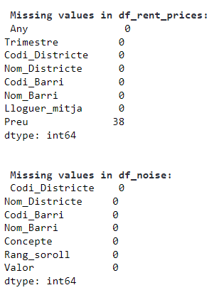
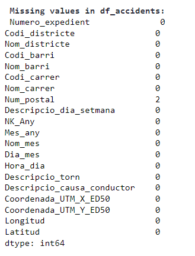

**Rent Prices Dataset (df_rent_prices)**
    
This dataset provides insights into the average rental prices in different districts and neighborhoods of a city, presumably Barcelona, for the year 2017.

**Columns and Data Types:**

- **Any** (int64): Year (e.g., 2017).
- **Trimestre** (int64): Quarter of the year, ranging from 1 to 4.
- **Codi_Districte** (int64): Code associated with each district.
- **Nom_Districte** (object): Name of the district.
- **Codi_Barri** (int64): Code for each neighborhood within the district.
- **Nom_Barri** (object): Name of the neighborhood.
- **Lloguer_mitja** (object): Type of rental average by EUR/sqm or total rent average
- **Preu** (float64): Average monthly rental price in Euros.
    
**38 missing values in the Preu (Price) column**

**Noise Levels Dataset (df_noise):**
This dataset provides information on the percentage of the population exposed to various noise levels in different districts and neighborhoods of Barcelona.

**Columns and Data Types:**

- **Codi_Districte** (int64): Code associated with each district.
- **Nom_Districte** (object): Name of the district.
- **Codi_Barri** (int64): Code for each neighborhood within the district.
- **Nom_Barri** (object): Name of the neighborhood.
- **Concepte** (object): Concept, which seems to indicate the total day.
- **Rang_soroll** (object): Noise level range in decibels (dB).
- **Valor** (object): Percentage of the population exposed to the corresponding noise level.

    
**0 missing values in the dataset**

**Accidents Dataset (df_accidents):**
This dataset provides detailed information on traffic accidents attributed to driver causes in Barcelona for the year 2017.

**Columns and Data Types:**

- **Numero_expedient** (object): Accident report number.
- **Codi_districte** (int64): Code associated with each district.
- **Nom_districte** (object): Name of the district.
- **Codi_barri** (int64): Code for each neighborhood within the district.
- **Nom_barri** (object): Name of the neighborhood.
- **Codi_carrer** (int64): Code for each street where the accident occurred.
- **Nom_carrer** (object): Name of the street.
- **Num_postal** (object): Postal number related to the accident location.
- **Descripcio_dia_setmana** (object): Description of the day of the week of the accident.
- **NK_Any** (int64): Year of the accident.
- **Mes_any** (int64): Month of the accident as a number.
- **Nom_mes** (object): Name of the month.
- **Dia_mes** (int64): Day of the month.
- **Hora_dia** (int64): Hour of the day of the accident.
- **Descripcio_torn** (object): Description of the time period (e.g., morning, evening).
- **Descripcio_causa_conductor** (object): Cause attributed to the driver.
- **Coordenada_UTM_X_ED50** (float64): X coordinate in UTM ED50 format.
- **Coordenada_UTM_Y_ED50** (float64): Y coordinate in UTM ED50 format.
- **Longitud** (float64): Longitude of the accident location.
- **Latitud** (float64): Latitude of the accident location.

    
**0 missing values in the dataset**

### 2.1 Summary Statistics
Let's see first the summary statistics for for the Rent Prices by district in Barcelona

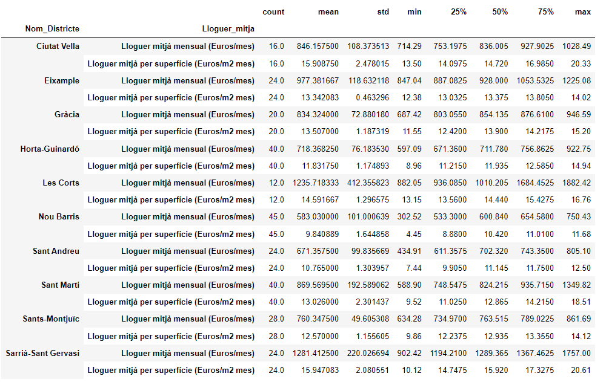

### 2.2 Distribution and Box Plots    

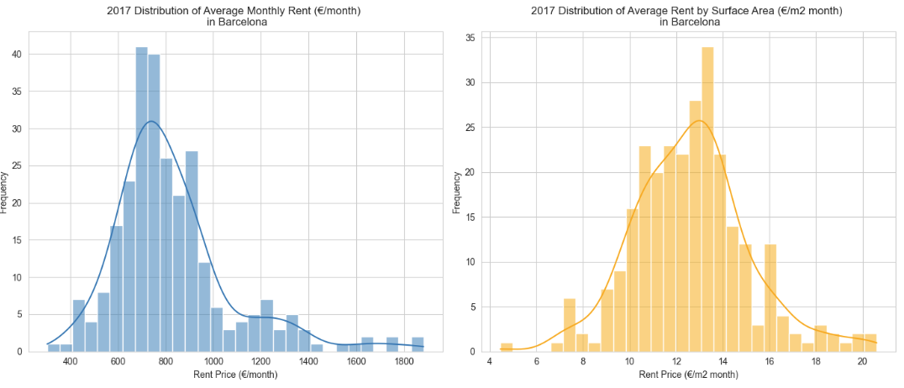
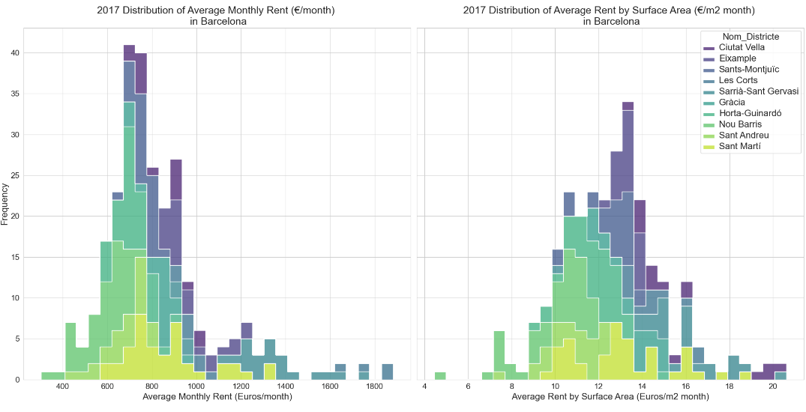
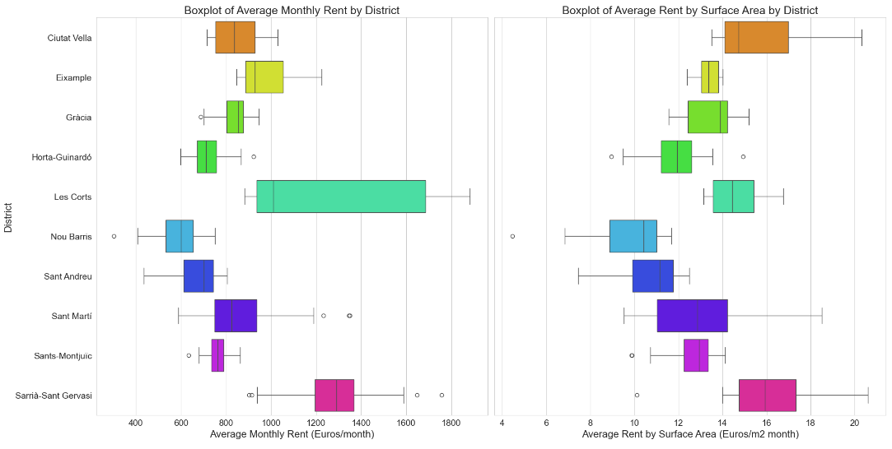
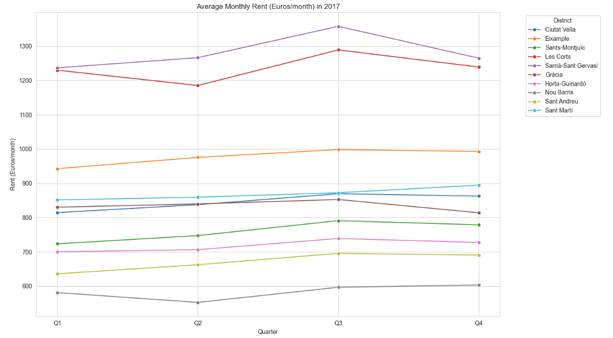
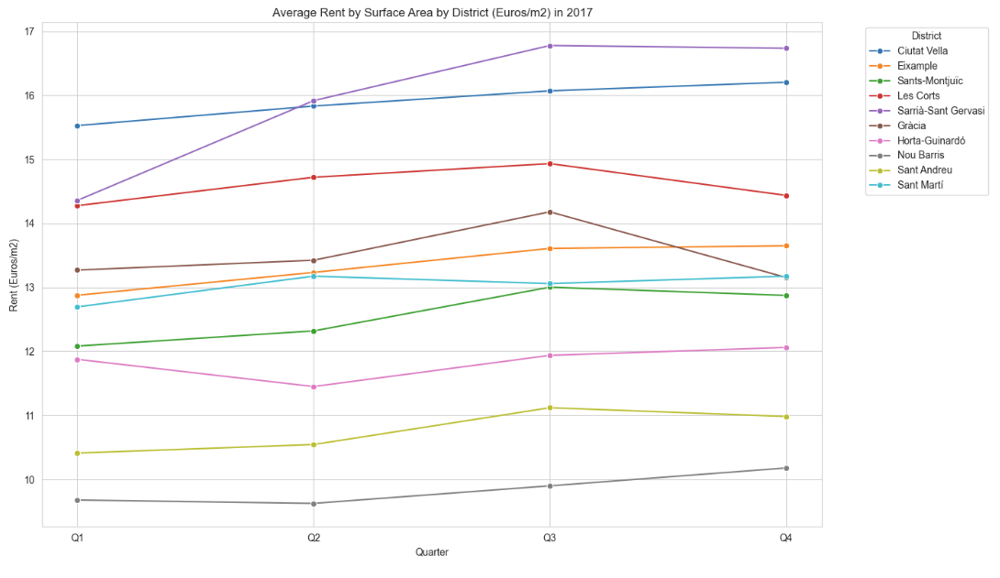

### 2.3 Preliminary Analysis of the Rent Prices Data

**Variability in Rent Prices:**

The district of Les Corts has the highest average monthly rent, with a mean of €1235.72, and it also displays the widest range in rent prices, evidenced by a standard deviation of €412.36.
Nou Barris is the district with the lowest average monthly rent at €583.03 and also records the lowest average rent per surface area, with a mean of €9.84 per square meter per month.

**Comparison:**

Districts like Ciutat Vella and Eixample have relatively high average rents per surface area, which could suggest that smaller apartments in these areas come with a premium compared to larger ones.
The average rent per square meter does not vary as much as the total monthly rent, indicating that apartment size may be a significant factor in the total rent price differences among districts.

**High-End Districts:**

Sarrià-Sant Gervasi stands out with the highest average rent prices, both monthly and per square meter, marking it as one of the priciest districts in Barcelona for residents.
    
**Affordability and Options:**

Horta-Guinardó offers a significant number of rental options (40 entries for both rent types) with a lower average monthly rent, suggesting a balance between affordability and availability.
Nou Barris and Horta-Guinardó show less variability in rent per square meter, indicating more uniform pricing within these districts compared to others.
    
**Middle Range Options:**

Gràcia and Sant Martí offer moderate average rents and a moderate number of listings, which might appeal to renters seeking a middle ground in terms of pricing and options.
    
**Outliers:**

Outliers can be easily identified from the box plot, although they are few and for the purpose of this analysis, they will not be removed.

### 2.4 Let's Map 2017 Rent Prices in Barcelona

- A very important step in analyzing the data is to visualize and understand the physical location where this data is coming from so let's create and map the rent prices data using folium

**For Plotting Maps Geo Dataset containing Neighborhoods Polygons of Barcelona is used**

Data/BarcelonaCiutat_Barris.csv

Source:https://opendata-ajuntament.barcelona.cat/data/es/dataset/20170706-districtes-barris/resource/b21fa550-56ea-4f4c-9adc-b8009381896e?inner_spa

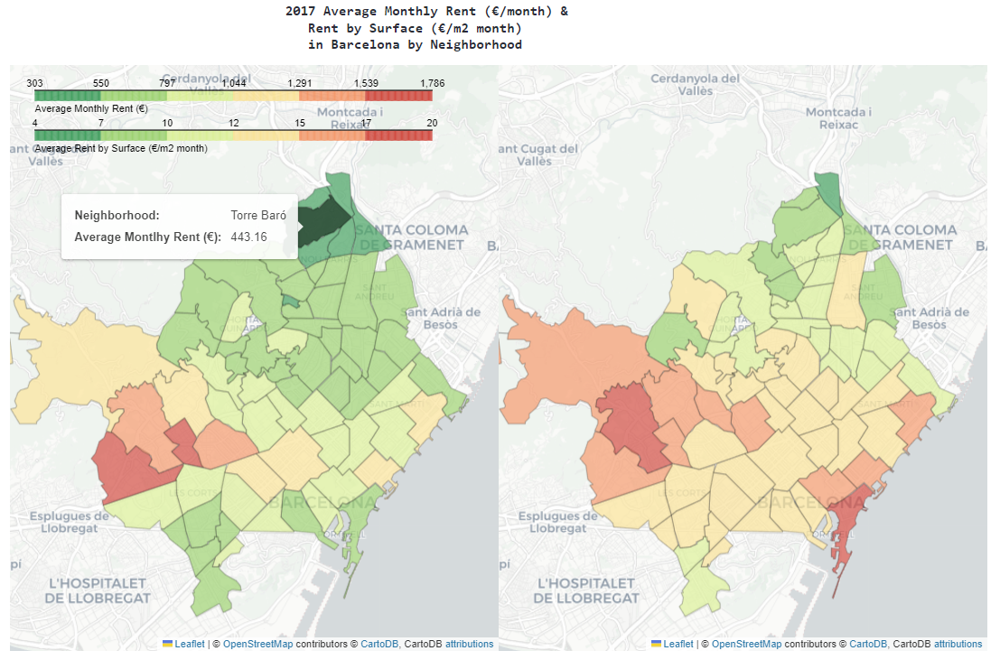

- Next step is to select which dataset and which fields to use. For this study let's take the accident data set 
- First let's explore and pre process and clean the data. 

## 3 Merge Accident Dataset with Rent Prices ###     

- The study will focus on summarizing and correlating the average noise levels by neighborhood and district in Barcelona in 2017.

 **First we need to process Noise Data**
The noise data fields represent the percentage of people exposed to different noise ranges in the different neighborhoods in order to get an estimated average value of noise level per neighborhood we will do the folowing:

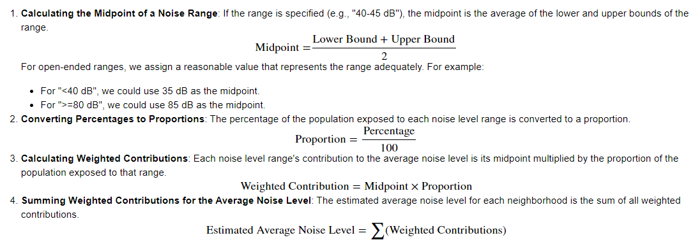
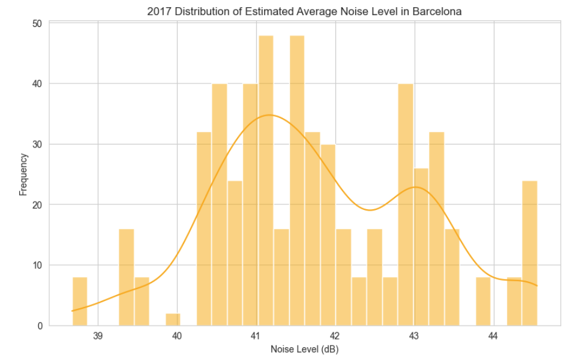
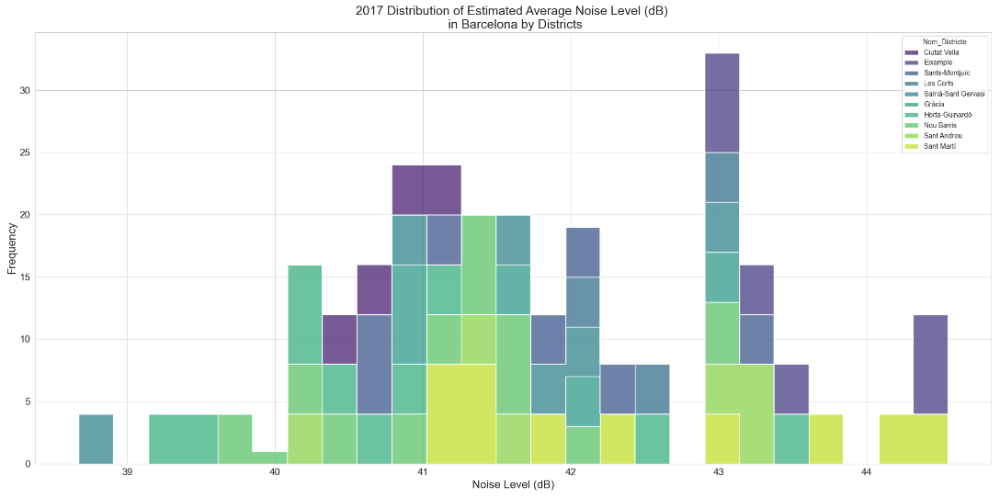
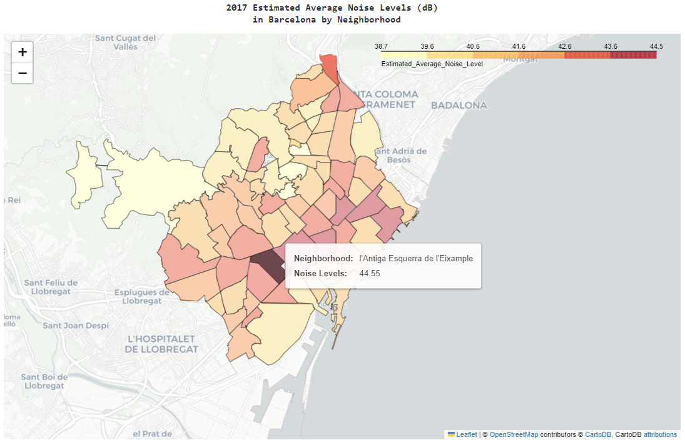

## 4 PCA

 - For PCA analysis, we will need meaningful variables. The two datasets we merged do not correlate well since traffic accident data cannot be easily related to rent prices. At most, there could be some relationship to noise levels in the neighborhoods, but many other factors would need to be considered for a thorough study.

- The grey dots represent the neighborhoods projected onto the first two principal components.
- The red arrows represent the original variables (Preu and Estimated_Average_Noise_Level). The direction and length of the arrows indicate how each variable influences the principal components.

From the biplot, you can observe:

- Both variables seem to contribute similarly to the first principal component, as indicated by the arrows pointing roughly in the same direction.
- The second principal component captures variation orthogonal to the first, as seen by the difference in direction of the arrows.

## 5 Conclusions   

**Results:**
The scree plot shows the variance explained by each of the principal components. In our case, since there were only two features ('Preu' and 'Estimated_Average_Noise_Level') to start with, there are only two principal components.

The first principal component explains a significant portion of the variance in the data set. The exact percentage can be noted from the height of the first bar in the scree plot. This indicates that this principal component captures most of the information that was spread out over the original two features.

The second principal component, although explaining less variance than the first, still holds some level of information. Since we only started with two features, the second principal component will capture the remaining variance.

The cumulative explained variance line shows that by including both principal components, we retain the entirety of the information present in the original dataset.

**Interpretation:**

The dominance of the first principal component suggests that there is a strong pattern in the dataset where 'Preu' and 'Estimated_Average_Noise_Level' vary together to some extent. If the first principal component explains a large proportion of the variance (close to 100%), this would imply a strong linear relationship between the two original variables.

Given that the two original features are 'Preu' (price) and 'Estimated_Average_Noise_Level', the first principal component could be interpreted as an index of 'cost of living' or 'rental desirability', assuming that noise level is an important factor in rental prices.

The second principal component would then capture variations in the data that are orthogonal (independent) to the first component. If the first component represents a 'cost of living' index, the second could represent variations that are independent of this index, perhaps related to aspects of the neighborhood that are not captured by price and noise level alone.

Despite the PCA suggesting that these two variables contribute similarly to the first principal component, the actual linear relationship between them is not strong, according to the correlation coefficient. This result suggests that other factors may be influencing the variation captured by the first principal component, or that the relationship between rent price and noise level is not linear and may be more complex.

These two datasets together do not show a strong correlation that would allow for further analysis of the increase in rental prices in Barcelona during 2017. Although there might be some relationship between noise levels and neighborhood rental prices, many other factors must be taken into account to perform a thorough study.

## 6 Complementary Analysis in Traffic Accident Data    

**Analysis**
    
- The distribution and maps clearly illustrate the locations with the most accidents, which, as expected, occur on the busier roads.
- Additional analysis of this dataset alone could range from examining accident trends to clustering to determine hot spots.

